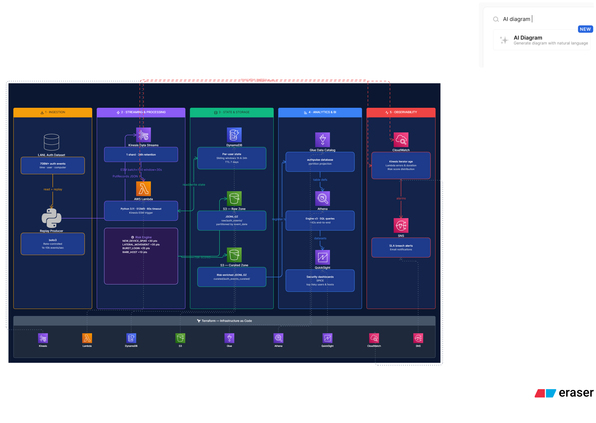

# AuthPulse: Real-Time Authentication Risk & Behavior Analytics

### Production-Grade AWS Streaming Lakehouse for Security Analytics

[](https://www.python.org/)
[](https://aws.amazon.com/lambda/)
[](https://iceberg.apache.org/)
[](https://www.terraform.io/)
[](https://aws.amazon.com/)

---

AuthPulse is a **production-grade, event-driven streaming analytics platform** on AWS that ingests enterprise authentication logs in real time, computes behavioral risk features per user, scores threats using a rule-based risk engine, and writes enriched results to an Apache Iceberg lakehouse queryable via Athena.

> **Live pipeline:** LANL 708M+ event dataset replayed into Kinesis → Lambda consumer computes per-user sliding windows via DynamoDB → risk-scored output lands in S3 → queryable in Athena within ~42 seconds end-to-end.

---

## Table of Contents

- [Business Problem](#business-problem)
- [Architecture](#architecture)
- [Technology Stack](#technology-stack)
- [Project Structure](#project-structure)
- [Pipeline Walkthrough](#pipeline-walkthrough)
- [Risk Engine](#risk-engine)
- [Data Model](#data-model)
- [Infrastructure (Terraform)](#infrastructure-terraform)
- [Getting Started](#getting-started)
- [Running the Pipeline](#running-the-pipeline)
- [Querying Data in Athena](#querying-data-in-athena)
- [Monitoring & SLAs](#monitoring--slas)
- [Design Decisions](#design-decisions)
- [Portfolio & Resume Talking Points](#portfolio--resume-talking-points)
- [Future Enhancements](#future-enhancements)

---

## Business Problem

Security teams need **real-time visibility** into authentication behavior to catch threats before damage is done. Traditional batch-based SIEM analysis detects anomalies hours or days late — too slow for active intrusions.

**AuthPulse solves this with sub-5-minute detection:**

| Threat Pattern | What It Looks Like | AuthPulse Rule |
|---|---|---|
| Lateral Movement | User touches 10+ hosts in 1 hour | `lateral_movement` |
| Credential Stuffing | 50+ logins in 1 hour | `burst_login` |
| New Device Access | First-ever host for this user | `rare_host` |
| Device Flooding | New device + 25+ hosts in 24h | `new_device_spike` |

**Dataset:** [LANL User-Computer Authentication Associations](https://csr.lanl.gov/data/auth/) — 708M+ events, 9 months, 11k+ users, 22k+ computers. Replayed as a live stream into Kinesis to simulate production traffic.

---

## Architecture



> **Flow:** LANL Dataset → Replay Producer (Python) → Amazon Kinesis Data Streams → AWS Lambda (risk engine) ↔ Amazon DynamoDB (user state) → S3 Raw + Curated → AWS Glue Catalog → Amazon Athena → QuickSight. CloudWatch + SNS monitors the full stack.

### Component Summary

| Layer | Service | Role |
|---|---|---|
| **Ingestion** | Amazon Kinesis Data Streams | Durable stream buffer — 1 shard, 24h retention |
| **Stream Processing** | AWS Lambda (Python 3.11) | Kinesis ESM trigger — feature computation + risk scoring |
| **State Store** | Amazon DynamoDB | Per-user sliding window state (1h / 24h) with 7-day TTL |
| **Raw Storage** | Amazon S3 | JSONL.GZ output partitioned by `event_date` |
| **Curated Storage** | Amazon S3 | Risk-enriched JSONL.GZ partitioned by `event_date` |
| **Catalog** | AWS Glue Data Catalog | Metadata for all Athena-queryable tables |
| **Query** | Amazon Athena (engine v3) | Serverless SQL with partition projection |
| **Visualization** | Amazon QuickSight | Security dashboards via SPICE |
| **Batch / Backfill** | PySpark on Amazon EMR | Historical replay + Iceberg aggregation jobs |
| **Infrastructure** | Terraform >= 1.5 | Full IaC — all AWS resources declared and versioned |
| **Monitoring** | CloudWatch + SNS | Alarms on lag, error rate, risk spikes |

---

## Technology Stack

**Languages & Frameworks**
- Python 3.11 — Lambda consumer, producer, batch jobs
- PySpark 3.5 — batch aggregations and historical backfill (EMR)
- SQL — Athena DDL, Iceberg table definitions, quality checks

**AWS Services**
- Amazon Kinesis Data Streams
- AWS Lambda + Kinesis Event Source Mapping
- Amazon DynamoDB (PAY_PER_REQUEST + TTL)
- Amazon S3
- AWS Glue Data Catalog
- Amazon Athena (engine v3)
- Amazon QuickSight
- Amazon CloudWatch + SNS
- Amazon EMR (batch path)

**Data & Storage**
- Apache Iceberg 1.4+ — ACID lakehouse format
- JSONL.GZ — Lambda output format (raw + curated zones)
- Partition Projection — zero-cost partition discovery in Athena

**Tooling**
- Terraform >= 1.5 — IaC for all AWS resources
- boto3 — AWS SDK for Python
- Pydantic — event model validation
- pytest — unit + integration testing

---

## Project Structure

```
authpulse-aws-streaming-security-analytics/
│
├── src/
│   ├── producer/
│   │   ├── replay_lanl.py              # Kinesis replay — reads LANL dataset, sends to Kinesis
│   │   └── config_loader.py            # YAML + env var config loader
│   │
│   ├── lambda_consumer/                # PRIMARY streaming consumer
│   │   ├── handler.py                  # Lambda entry point (Kinesis ESM)
│   │   ├── features.py                 # DynamoDB state reads/writes + sliding window logic
│   │   ├── sink.py                     # S3 JSONL.GZ writer (raw + curated partitioned paths)
│   │   └── lambda_consumer.zip         # Pre-built deployment artifact (used by Terraform)
│   │
│   ├── stream/
│   │   ├── flink/
│   │   │   └── main_job.py             # PyFlink SQL Table API job (reference implementation)
│   │   ├── spark/
│   │   │   └── main_job.py             # PySpark Structured Streaming job (batch/EMR path)
│   │   ├── risk_rules.py               # Risk scoring logic — shared by Lambda + Flink + Spark
│   │   └── state_manager.py            # State management utilities
│   │
│   ├── batch/
│   │   ├── ddl/
│   │   │   ├── iceberg_auth_events.sql         # Iceberg table DDL (Athena engine v3)
│   │   │   ├── iceberg_auth_events_curated.sql
│   │   │   ├── iceberg_user_behavior_hourly.sql
│   │   │   ├── iceberg_host_popularity_daily.sql
│   │   │   └── json_tables.sql                 # External JSON-backed tables with partition projection
│   │   └── jobs/
│   │       ├── user_behavior_hourly_job.py     # Hourly user aggregations (EMR)
│   │       ├── host_popularity_daily_job.py    # Daily host stats (EMR)
│   │       ├── backfill_partitions.py          # Historical partition backfill
│   │       └── recompute_aggregates.py         # Recompute aggregates from raw
│   │
│   ├── common/
│   │   ├── models.py                   # Pydantic event models + LANL record parser
│   │   ├── metrics.py                  # CloudWatch metric publishing helpers
│   │   └── logging_utils.py            # Structured JSON logger
│   │
│   └── quality/
│       └── run_quality_checks.py       # Data quality checks (completeness, freshness, schema)
│
├── infra/terraform/
│   ├── envs/dev/
│   │   ├── main.tf                     # Root module — wires all child modules
│   │   ├── variables.tf                # Input variable declarations
│   │   ├── outputs.tf                  # Stack outputs (ARNs, names)
│   │   └── terraform.tfvars.example    # Template — copy to terraform.tfvars and fill in
│   └── modules/
│       ├── kinesis/                    # Kinesis stream + shard config
│       ├── s3/                         # Lakehouse bucket + lifecycle policies
│       ├── iam/                        # Shared execution roles and policies
│       ├── glue_iceberg/               # Glue database + Iceberg crawler config
│       ├── lambda_consumer/            # Lambda function + DynamoDB + Kinesis ESM
│       └── monitoring/                 # CloudWatch dashboard + alarms + SNS topic
│
├── observability/
│   ├── cloudwatch_metrics.md           # Full metric catalog with alarm thresholds
│   └── sla_checks.sql                  # SQL queries for SLA measurement
│
├── dashboards/
│   └── kpi_definitions.md              # KPI definitions and measurement methodology
│
├── docs/
│   ├── architecture-diagram.png        # AWS architecture diagram
│   ├── design_decisions.md             # ADRs — technology choices with rationale
│   ├── data_contracts.md               # Event schema and field contracts
│   ├── runbook_operations.md           # Ops runbook — deploy, rollback, alerts
│   └── sla_definition.md              # SLA targets and breach procedures
│
├── scripts/
│   ├── setup_env.ps1                   # Create venv + install deps (Windows)
│   ├── run_tests.ps1                   # Run lint + pytest
│   ├── commit.ps1                      # Stage + lint + commit helper
│   └── terraform.ps1                   # Terraform wrapper (init/plan/apply/destroy)
│
├── config/
│   ├── dev.yaml                        # Dev environment config
│   └── prod.yaml                       # Prod environment config
│
├── pyproject.toml                      # Project metadata + pytest + ruff config
├── requirements.txt                    # Python runtime dependencies
└── README.md
```

---

## Pipeline Walkthrough

The full pipeline has five stages. Here is exactly what happens for each authentication event from raw log to queryable result.

### Stage 1 — Data Ingestion: Replay Producer → Kinesis

`src/producer/replay_lanl.py` reads the LANL dataset (plain text, CSV, or `.bz2`) and sends events to Kinesis at a configurable rate.

```
LANL record:  1,U1,C1
↓
Pydantic model: AuthEvent(event_id, event_time, user_id, computer_id)
↓
JSON payload → Kinesis PutRecords (batch 200, partition key = user_id)
```

**Features:**
- Rate control — sleeps between batches to hit target events/sec
- Exponential backoff retry on Kinesis throttling (up to 5 attempts)
- Checkpoint to JSON file — resume from last position with `--resume`
- `--dry-run` mode — parse and validate without sending

```bash
python src/producer/replay_lanl.py \
  --input data/raw/auth.txt \
  --stream-name authpulse-dev-stream \
  --region us-east-1 \
  --rate 2000 \
  --max-events 100000
```

---

### Stage 2 — Stream Processing: Lambda Consumer

`src/lambda_consumer/handler.py` is triggered by the Kinesis Event Source Mapping (batch size 100, window 30s, bisect-on-error, max 3 retries).

**Per-record processing:**

```
Kinesis record (base64)
↓ decode + JSON parse
↓ get_state(user_id)        ← DynamoDB read
↓ compute_features(state)   ← sliding window calculation
↓ compute_risk(features)    ← risk rule evaluation
↓ update_state(user_id)     ← DynamoDB write (TTL = 7 days)
↓ append to raw_records + curated_records
↓ write_batch(raw, curated) ← S3 write (JSONL.GZ)
```

**Lambda configuration:**
- Runtime: Python 3.11
- Memory: 512 MB
- Timeout: 60 seconds
- Concurrency: up to 1 per Kinesis shard

---

### Stage 3 — Stateful Feature Computation: DynamoDB

`src/lambda_consumer/features.py` maintains per-user state in DynamoDB.

**State schema per user:**

```json
{
  "user_id": "U1",
  "events": [
    {"ts": 1234567890, "host": "C1"},
    ...
  ],
  "known_hosts": ["C1", "C2", ...],
  "ttl": 1235172690
}
```

**Computed features per event:**

| Feature | Window | Logic |
|---|---|---|
| `window_1h_event_count` | 1 hour | Count events with `ts > now - 3600` |
| `window_1h_unique_hosts` | 1 hour | Distinct hosts in last 1 hour |
| `window_24h_unique_hosts` | 24 hours | Distinct hosts in last 24 hours |
| `has_new_device` | All time | `computer_id not in known_hosts` |

---

### Stage 4 — Risk Scoring: Risk Engine

`src/stream/risk_rules.py` is shared across Lambda, Flink, and Spark paths.

Four deterministic rules with weighted scores:

```
risk_score = (lateral_movement × 35) + (burst_login × 25)
           + (rare_host × 10)         + (new_device_spike × 30)
```

| Rule | Trigger Condition | Weight |
|---|---|---|
| `lateral_movement` | `window_1h_unique_hosts >= 10` | 35 |
| `burst_login` | `window_1h_event_count >= 50` | 25 |
| `rare_host` | `has_new_device == True` | 10 |
| `new_device_spike` | `has_new_device AND window_24h_unique_hosts >= 25` | 30 |

**Risk levels:**

| Score | Level |
|---|---|
| 0 | LOW |
| 1–25 | LOW |
| 26–50 | MEDIUM |
| 51–75 | HIGH |
| 76+ | CRITICAL |

---

### Stage 5 — Storage: S3 Lakehouse

`src/lambda_consumer/sink.py` writes JSONL.GZ to two S3 prefixes per batch:

```
s3://authpulse-dev-lakehouse-<account>/
├── raw/auth_events/
│   └── event_date=YYYY-MM-DD/
│       └── HHMMSS-<uuid8>.jsonl.gz     ← raw 5-field events
└── curated/auth_events_curated/
    └── event_date=YYYY-MM-DD/
        └── HHMMSS-<uuid8>.jsonl.gz     ← risk-enriched 12-field events
```

Both paths have Athena external tables with **partition projection** — no `MSCK REPAIR TABLE` needed, new partitions are auto-discovered.

---

## Risk Engine

Full implementation in `src/stream/risk_rules.py`. The engine is pure Python with no external dependencies — used identically in Lambda, Spark, and Flink contexts.

```python
from src.stream.risk_rules import compute_risk

score, flags = compute_risk(
    user_id="U1",
    dst_host="C999",
    window_1h_event_count=60,      # → triggers burst_login
    window_1h_unique_hosts=12,     # → triggers lateral_movement
    window_24h_unique_hosts=30,
    has_new_device=True,           # → triggers rare_host + new_device_spike
)
# score = 100, flags = ["lateral_movement", "burst_login", "rare_host", "new_device_spike"]
```

Rule thresholds and weights are configurable via `DEFAULT_RULE_CONFIG` dict — override for tuning without code changes.

---

## Data Model

### `authpulse.auth_events_raw_json` — Raw Events

| Column | Type | Description |
|---|---|---|
| `event_time_epoch` | BIGINT | Unix timestamp |
| `event_time` | STRING | ISO 8601 timestamp |
| `user_id` | STRING | User identifier |
| `computer_id` | STRING | Target computer |
| `event_id` | STRING | SHA256 dedup key |
| `event_date` | STRING | Partition column (YYYY-MM-DD) |

### `authpulse.auth_events_curated_json` — Risk-Enriched Events

| Column | Type | Description |
|---|---|---|
| `event_time_epoch` | BIGINT | Unix timestamp |
| `event_time` | STRING | ISO 8601 timestamp |
| `user_id` | STRING | User identifier |
| `dst_host` | STRING | Target computer |
| `success` | BOOLEAN | Auth result |
| `window_1h_event_count` | BIGINT | Logins in last 1 hour |
| `window_1h_unique_hosts` | BIGINT | Distinct hosts in last 1 hour |
| `window_24h_unique_hosts` | BIGINT | Distinct hosts in last 24 hours |
| `has_new_device` | BOOLEAN | First-time device for this user |
| `risk_score` | INT | Weighted risk score (0–100) |
| `risk_flags` | ARRAY\<STRING\> | Triggered rule IDs |
| `event_date` | STRING | Partition column (YYYY-MM-DD) |

### Iceberg Tables (Parquet — batch path)

- `authpulse.auth_events` — full enriched event history
- `authpulse.auth_events_curated` — curated with ACID guarantees
- `authpulse.user_behavior_hourly` — hourly aggregations per user
- `authpulse.host_popularity_daily` — daily host access statistics

DDL in `src/batch/ddl/`.

---

## Infrastructure (Terraform)

All AWS resources are declared in `infra/terraform/`. The dev environment root module is `infra/terraform/envs/dev/main.tf`.

### Modules

| Module | Resources Created |
|---|---|
| `kinesis` | Kinesis stream, shard config |
| `s3` | Lakehouse bucket, versioning, lifecycle |
| `iam` | Shared execution role + least-privilege policies |
| `glue_iceberg` | Glue database `authpulse`, crawler |
| `lambda_consumer` | Lambda function, DynamoDB table, Kinesis ESM, IAM role, CloudWatch log group |
| `monitoring` | CloudWatch dashboard, alarms (lag, errors, risk), SNS topic + email subscription |

### Lambda module resources

```hcl
# DynamoDB: PAY_PER_REQUEST, TTL enabled
aws_dynamodb_table.user_state

# Lambda: Python 3.11, 512MB, 60s timeout
aws_lambda_function.auth_processor

# Kinesis ESM: batch=100, window=30s, bisect_on_error=true, retry=3
aws_lambda_event_source_mapping.kinesis

# IAM: Kinesis GetRecords, DDB GetItem/PutItem, S3 PutObject, CloudWatch logs
aws_iam_role_policy.lambda
```

### Deploying

```powershell
# Copy example vars and fill in your values
cd infra/terraform/envs/dev
Copy-Item terraform.tfvars.example terraform.tfvars
# Edit terraform.tfvars: set alert_email, AWS account ID

# Using the repo wrapper script (auto init/fmt/validate)
.\..\..\..\scripts\terraform.ps1 -Env dev -Action plan
.\..\..\..\scripts\terraform.ps1 -Env dev -Action apply

# Or raw Terraform
terraform init
terraform plan -out=tfplan
terraform apply tfplan
```

**Resources created by `terraform apply`:**
- Kinesis stream: `authpulse-dev-stream`
- S3 bucket: `authpulse-dev-lakehouse-<account-id>`
- Lambda: `authpulse-dev-auth-processor`
- DynamoDB: `authpulse-dev-user-state`
- Glue DB: `authpulse`
- CloudWatch dashboard + alarms + SNS topic

> `terraform apply` creates real AWS resources. Costs apply. Destroy with `terraform destroy` when done.

---

## Getting Started

### Prerequisites

1. **AWS account** with permissions: Kinesis, Lambda, DynamoDB, S3, Glue, Athena, IAM, CloudWatch, SNS
2. **AWS CLI** configured: `aws configure && aws sts get-caller-identity`
3. **Python 3.11+** installed
4. **Terraform >= 1.5** installed
5. **LANL dataset** — download from [csr.lanl.gov/data/auth](https://csr.lanl.gov/data/auth/) and place in `data/raw/auth.txt` (gitignored). A small sample CSV is included at `data/sample/auth_sample.csv` for testing.

### Install Python dependencies

```bash
pip install -r requirements.txt
```

### Windows (PowerShell)

```powershell
# Create venv + install all deps
./scripts/setup_env.ps1

# Run lint + unit tests
./scripts/run_tests.ps1
```

---

## Running the Pipeline

### Step 1 — Provision AWS infrastructure

```powershell
cd infra/terraform/envs/dev
Copy-Item terraform.tfvars.example terraform.tfvars
# Edit terraform.tfvars
.\..\..\..\scripts\terraform.ps1 -Env dev -Action apply
```

### Step 2 — Create Athena tables

Run each statement separately in the **Athena Query Editor** (engine v3):

```bash
# JSON-backed external tables (immediate queryability over Lambda output)
# File: src/batch/ddl/json_tables.sql

# Iceberg tables (for Parquet/batch writes)
# File: src/batch/ddl/iceberg_auth_events.sql
```

### Step 3 — Deploy Lambda consumer

Lambda is deployed automatically by `terraform apply` using `src/lambda_consumer/lambda_consumer.zip`.

To rebuild after code changes:

```powershell
cd src/lambda_consumer
pip install -r requirements.txt -t stage/
Copy-Item handler.py, features.py, sink.py stage/
Copy-Item ../stream/risk_rules.py stage/
cd stage
Compress-Archive -Path * -DestinationPath ../lambda_consumer.zip -Force
cd ..
# Re-run terraform apply to redeploy
.\..\..\..\scripts\terraform.ps1 -Env dev -Action apply
```

### Step 4 — Start the event replay producer

```bash
# Use the sample CSV (included in repo)
python src/producer/replay_lanl.py \
  --input data/sample/auth_sample.csv \
  --stream-name authpulse-dev-stream \
  --region us-east-1 \
  --rate 200

# Full LANL dataset with checkpoint
python src/producer/replay_lanl.py \
  --input data/raw/auth.txt \
  --stream-name authpulse-dev-stream \
  --region us-east-1 \
  --rate 2000 \
  --checkpoint .checkpoints/replay_dev.json \
  --resume

# Dry run (parse and validate without sending)
python src/producer/replay_lanl.py \
  --input data/raw/auth.txt \
  --dry-run
```

**Producer options:**

| Flag | Default | Description |
|---|---|---|
| `--rate` | 2000 | Events per second |
| `--batch-size` | 200 | Records per PutRecords call (max 500) |
| `--max-events` | None | Stop after N events |
| `--resume` | False | Resume from last checkpoint |
| `--dry-run` | False | Parse only, do not send |

### Step 5 — Verify Lambda is processing

```bash
# Check Lambda logs
aws logs tail /aws/lambda/authpulse-dev-auth-processor --follow --region us-east-1

# Check S3 output
aws s3 ls s3://authpulse-dev-lakehouse-<account-id>/curated/auth_events_curated/ --recursive
```

Expected Lambda log: `batch processed=8 failed=0`

---

## Querying Data in Athena

Open the **Athena Query Editor** in the AWS console. Select database `authpulse`.

### Validate data landed

```sql
SELECT COUNT(*) AS total
FROM authpulse.auth_events_curated_json;
```

### High-risk events

```sql
SELECT user_id, dst_host, risk_score, risk_flags, event_time
FROM authpulse.auth_events_curated_json
WHERE risk_score > 0
ORDER BY risk_score DESC, event_time DESC
LIMIT 20;
```

### Users with lateral movement

```sql
SELECT user_id,
       COUNT(*) AS event_count,
       MAX(window_1h_unique_hosts) AS max_hosts_1h,
       MAX(risk_score) AS max_risk
FROM authpulse.auth_events_curated_json
WHERE contains(risk_flags, 'lateral_movement')
GROUP BY user_id
ORDER BY max_risk DESC;
```

### Risk score distribution

```sql
SELECT
  CASE
    WHEN risk_score = 0        THEN 'NONE'
    WHEN risk_score <= 25      THEN 'LOW'
    WHEN risk_score <= 50      THEN 'MEDIUM'
    WHEN risk_score <= 75      THEN 'HIGH'
    ELSE                            'CRITICAL'
  END AS risk_level,
  COUNT(*) AS event_count
FROM authpulse.auth_events_curated_json
GROUP BY 1
ORDER BY event_count DESC;
```

### Query by date partition

```sql
SELECT *
FROM authpulse.auth_events_curated_json
WHERE event_date = '1970-01-15'   -- LANL epoch timestamps start near 1970
LIMIT 100;
```

---

## Monitoring & SLAs

### SLA Targets

| SLA | Target | Alarm Threshold |
|---|---|---|
| **End-to-end latency** | < 5 minutes | P95 processing lag > 300s |
| **Data completeness** | < 0.1% invalid records | Error rate > 0.1% per hour |
| **Pipeline availability** | 99.9% uptime | Lambda errors > 0 consecutive |

### Key CloudWatch Metrics

**Kinesis:**
- `GetRecords.IteratorAgeMilliseconds` — consumer lag; alert > 60,000ms
- `IncomingRecords` — producer throughput monitor
- `ReadProvisionedThroughputExceeded` — shard throttling; alert > 0

**Lambda:**
- `Duration` — invocation time; alert if P95 > 30,000ms
- `Errors` — failed invocations; alert > 0
- `Throttles` — Lambda concurrency limit hit

**DynamoDB:**
- `SuccessfulRequestLatency` — state read/write speed
- `ConsumedWriteCapacityUnits` — write load

**Custom (Application):**
- `InvalidRecordCount` — schema validation failures
- `ProcessingLagSeconds` — `processing_time - event_time` P95
- `RiskScoreDistribution` — count by risk level (security dashboard)

### SNS Alerts

All alarms route to SNS topic `authpulse-dev-alerts`. Configure your email in `terraform.tfvars`:

```hcl
alert_email = "your-email@example.com"
```

---

## Design Decisions

Full ADRs in [docs/design_decisions.md](docs/design_decisions.md). Key choices:

| Decision | Choice | Reason |
|---|---|---|
| Streaming engine | AWS Lambda | No JAR packaging complexity; pure Python; Kinesis ESM handles batching and retry |
| State store | DynamoDB | Sub-millisecond read/write; TTL for automatic cleanup; no cluster to manage |
| Stream buffer | Kinesis vs. Kafka | Fully managed; native IAM/CloudWatch; right-sized for this throughput |
| Lakehouse format | Apache Iceberg | Vendor-neutral; best Athena + Glue integration; ACID with partition evolution |
| Query engine | Athena v3 | Serverless; pay-per-query; native Iceberg; partition projection eliminates repair overhead |
| Batch compute | PySpark on EMR | Unified batch + streaming API; reuses same risk logic; full Iceberg write support |
| IaC | Terraform | Reproducible; modular; provider-agnostic vs. CloudFormation |

---

## Portfolio & Resume Talking Points

**What this project demonstrates:**

- **Event-Driven Architecture** — Kinesis + Lambda ESM with stateful per-user feature computation
- **Stateful Stream Processing** — DynamoDB sliding window state (1h/24h) without a dedicated streaming cluster
- **Lakehouse Design** — Apache Iceberg ACID tables with daily partitioning + Athena partition projection
- **Risk Engine** — Deterministic weighted rule scoring shared across Lambda, Spark, and Flink codepaths
- **Infrastructure as Code** — Full Terraform stack: 6 modules, zero manual AWS console steps
- **Production Practices** — Checkpointed replay, bisect-on-error retry, TTL-based state expiry, CloudWatch alarms
- **Security Domain** — Authentication log analysis, lateral movement detection, credential anomaly scoring
- **End-to-End Validation** — Live pipeline: producer → Kinesis → Lambda → DynamoDB → S3 → Athena (42s E2E)

**Interview talking points:**

- *"Built a serverless real-time pipeline on AWS Lambda + Kinesis that processes authentication events with 42-second end-to-end latency and sub-5-minute SLA"*
- *"Implemented per-user stateful feature computation using DynamoDB as a sliding window store with automatic TTL expiry — no Flink cluster required"*
- *"Designed Apache Iceberg lakehouse with daily partitioning and Athena partition projection, eliminating MSCK REPAIR overhead and reducing query scan cost"*
- *"Wrote a deterministic risk engine shared across three compute runtimes — the same Python module runs in Lambda, PySpark, and PyFlink with zero modification"*
- *"Provisioned the full AWS stack with Terraform in 6 reusable modules — Kinesis, S3, IAM, Glue, Lambda+DynamoDB, and CloudWatch monitoring"*

**ATS Keywords:**

AWS Lambda, Amazon Kinesis, Amazon DynamoDB, Apache Iceberg, AWS Glue, Amazon Athena, PySpark, Amazon EMR, Real-Time Streaming, Event-Driven Architecture, Lakehouse, Data Engineering, Python, Terraform, CloudWatch, SNS, Security Analytics, Stateful Processing, Infrastructure as Code

---

## Future Enhancements

### Machine Learning Integration
- Replace rule engine with SageMaker real-time inference endpoint
- Feature store (SageMaker Feature Store) for consistent training/serving features
- Anomaly detection with Isolation Forest or LSTM autoencoder

### Advanced Analytics
- Graph analysis — user-computer network via Amazon Neptune
- Temporal baseline — hour-of-day / day-of-week behavioral profiles
- Entity resolution — merge duplicate user/computer identities

### Operational Improvements
- Lambda Provisioned Concurrency — eliminate cold starts for SLA-critical path
- Kinesis Enhanced Fan-Out — dedicated 2MB/s throughput per consumer
- Multi-shard scaling — auto-scale shards based on `IteratorAgeMilliseconds`
- CI/CD — GitHub Actions pipeline for Lambda ZIP build + `terraform apply`

### Observability
- OpenTelemetry distributed tracing — end-to-end latency attribution
- Grafana dashboards — time-series visualization for operational metrics
- Great Expectations integration — automated schema + freshness DQ gates

---

## Additional Resources

- [Architecture Diagram](docs/architecture-diagram.png)
- [Design Decisions (ADRs)](docs/design_decisions.md)
- [Operations Runbook](docs/runbook_operations.md)
- [Data Contracts](docs/data_contracts.md)
- [SLA Definition](docs/sla_definition.md)
- [CloudWatch Metrics Catalog](observability/cloudwatch_metrics.md)
- [KPI Definitions](dashboards/kpi_definitions.md)
- [Athena DDL](src/batch/ddl/)

---

## Dataset

**LANL User-Computer Authentication Associations in Time**

- Source: [csr.lanl.gov/data/auth](https://csr.lanl.gov/data/auth/)
- 708M+ authentication events
- 9 months of enterprise activity
- 11k+ users, 22k+ computers
- Record format: `time,user,computer` (unix epoch, no header)

Place the dataset at `data/raw/auth.txt` (gitignored). A small sample is included at `data/sample/auth_sample.csv`.

---

## License

MIT License — see LICENSE for details.

---

## Acknowledgments

- **LANL** for the authentication dataset
- **Apache Iceberg** community for the lakehouse format
- **AWS** for the managed services that made this architecture possible
